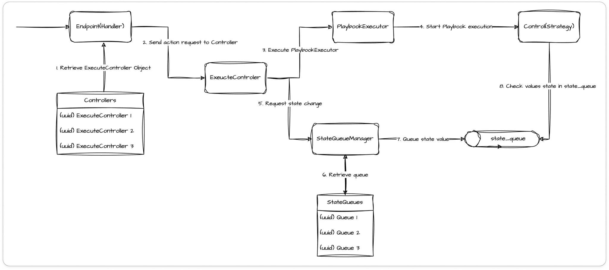
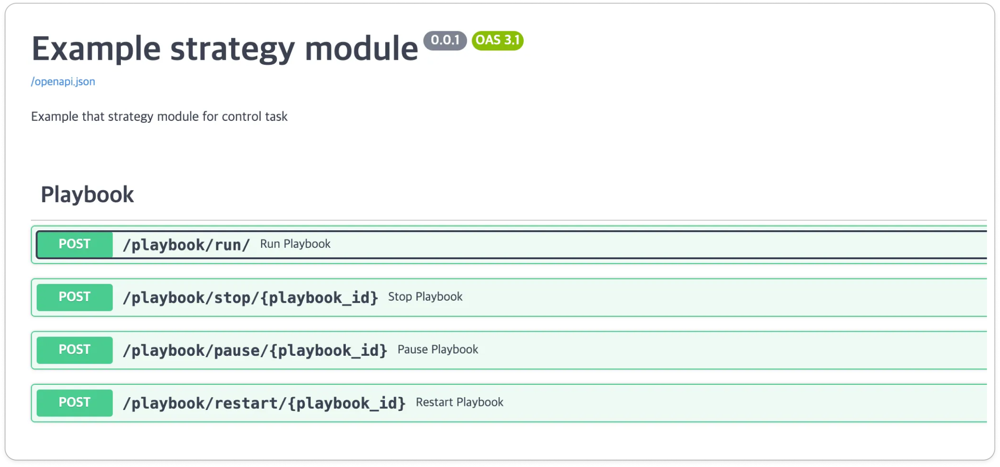
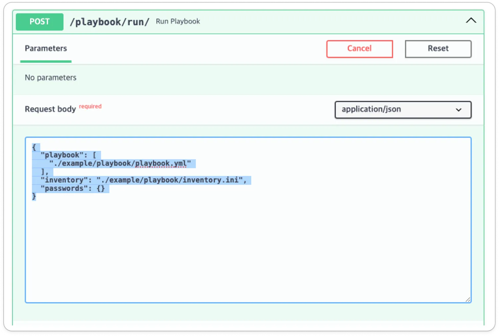
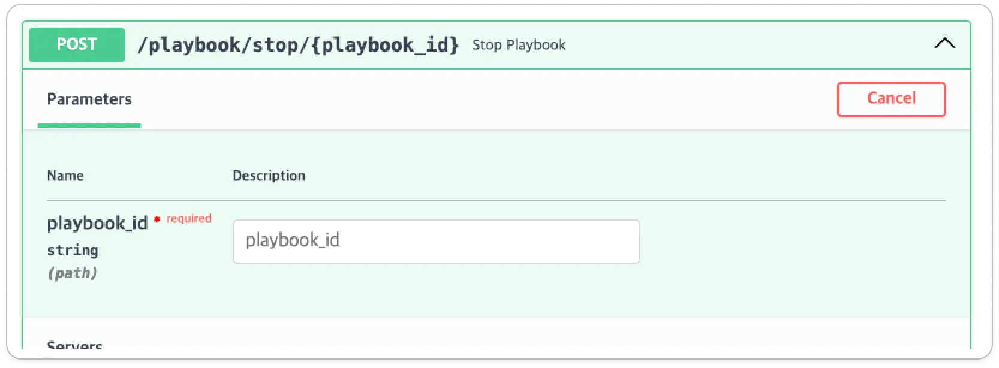

### Overview 🙌🏻

---
❗❗❗This content was developed with ansible-core 2.12 and ansible 5.0 versions.❗❗❗

This document provides an example of how to execute a custom Ansible strategy module. The custom strategy module, `Control`, is not a command-line tool but an Ansible object (Python code) designed for asynchronous playbook execution.

This repository includes a FastAPI-based application (web service) that enables the execution of the developed `Control` strategy module. The execution structure is as follows.



### Quick start

---

1. Create Docker Containers
    
    The working directory is `example/docker`. (Navigate to the directory before proceeding)
    
    - Run the `docker-compose.yml` file in the directory:
        
        ```bash
        ! docker-compose up -d
        ```
        
2. SSH Key Exchange
    - Generate SSH key (if the key does not exist in the local environment)
        
        ```bash
        ! ssh-keygen
        ```
        
    - Copy SSH key
        
        ```bash
        # The port numbers for the containers are 220 (vm1) and 221 (vm2). The password is 'test1234'.
        ! ssh-copy-id -p 220 root@localhost
        ! ssh-copy-id -p 221 root@localhost
        ```
        
    - Verify container access
        
        ```bash
        ! ssh -p 220 root@localhost # Verify successful connection
        ! ssh -p 221 root@localhost # Verify successful connection
        ```
        
3. Run the Application (Web Service)
    
    The working directory is the `project root (./)`. (Navigate to the directory before proceeding)
    - Install Dependency Modules     
        ```bash
        pip install -r requirements.txt
        ```
    - Execute the `main.py` function.
        
        ```bash
        python main.py
        ```
        
    - Access `localhost:8080/docs` to verify.
        
4. How to Control Using Example Ansible and API
    
    The playbook written as an example is located in `example/playbook`.
    
    - Run the playbook through `localhost:8080/playbook/run`
        
        ```json
        # Request body example for execution
        {
          "playbook": [
            "./example/playbook/playbook.yml"
          ],
          "inventory": "./example/playbook/inventory.ini",
          "passwords": {}
        }
        
        ```
        
        
        
    - Check the logs from the running application and verify the `playbook_id` received in the API response
        
        
        
    - Use `playbook_id` to control via API
        
        